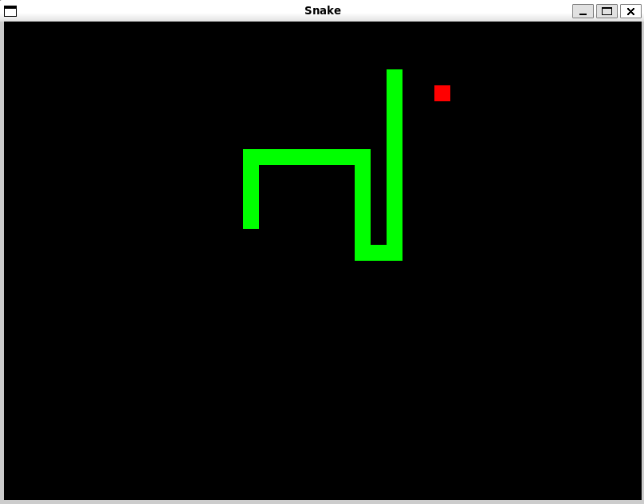

# Step01 - Implementazione dello snake e della frutta

Per il mio progetto ho deciso di partire implementando un semplice snake di base.
Al momento, il gioco gestisce già l’allungamento del serpente in caso di collisione con un frutto posizionato casualmente sulla mappa.



## 📁 Struttura del Progetto

```
mySnakeGame/
├── CMakeLists.txt              # Configurazione build CMake
├── build/                      # Directory di build
├── resources/                  # Risorse del gioco
│   └── imgs/                   # Immagini e texture
└── step01/                     # Prima implementazione
    ├── headers/                # File header (.hpp)
    │   ├── engine.hpp
    │   ├── snake.hpp
    │   └── fruit.hpp
    ├── src/                    # Implementazioni base (.cpp)
    │   ├── main.cpp
    │   ├── engine.cpp
    │   ├── snake.cpp
    │   └── fruit.cpp
    └── functionHandler/        # Handler specifici
        └── engineHandler/      # Funzioni del motore di gioco
            ├── input.cpp       # Gestione input
            ├── update.cpp      # Logica di aggiornamento
            ├── draw.cpp        # Rendering
            ├── snakeFunction.cpp # Funzioni specifiche del serpente
            └── fruitFunction.cpp # Funzioni specifiche del frutto
```

## 🧩 Classi principali
### `Engine.hpp/.cpp`
La classe **Engine** è il cuore del gioco che coordina tutti i componenti e gestisce il game loop principale.

**Componenti principali:**
- **Window Management**: Gestisce la finestra SFML (800x600px, 60 FPS)
- **Game State**: Mantiene lo stato del serpente, direzione, velocità e frutta
- **Timing System**: Controlla la velocità di movimento del serpente

**Attributi chiave:**
```cpp
vector<Snake> snake;           // Serpente composto da sezioni
int snakeDirection;            // Direzione corrente (enum Direction)
deque<int> direction;          // Coda delle direzioni input
int speed;                     // Velocità del serpente (4 iniziale)
int sectionToAdd;              // Sezioni da aggiungere dopo mangiare frutta
Fruit fruit;                   // Frutta da raccogliere
Time timeSinceLastMove;        // Timer per controllo movimento
```

**Game Loop Architecture:**
- **`input()`** → [`input.cpp`](functionHandler/engineHandler/input.cpp): Gestisce eventi tastiera con lambda SFML 3.0
- **`update()`** → [`update.cpp`](functionHandler/engineHandler/update.cpp): Aggiorna posizioni, collisioni e logica di gioco  
- **`draw()`** → [`draw.cpp`](functionHandler/engineHandler/draw.cpp): Rendering di serpente e frutta

**Funzioni specializzate:**
- `addDirection(Direction)`: Aggiunge direzioni alla coda input per movimento fluido
- `newSnake()`: Inizializza un nuovo serpente
- `addSnakeSection()`: Aggiunge sezioni quando si mangia la frutta
- `moveFruit()`: Riposiziona casualmente la frutta dopo la raccolta

### `Snake.hpp/.cpp`
La classe **Snake** rappresenta una singola sezione del serpente, implementando il pattern Component-Based per la gestione modulare.

**Design Pattern:**
- **Entity Component**: Ogni sezione è un'entità indipendente
- **Composition over Inheritance**: Il serpente è composto da multiple istanze Snake
- **Encapsulation**: Separazione tra logica interna e interfaccia pubblica

**Attributi privati:**
```cpp
Vector2f position;         // Posizione logica della sezione  
RectangleShape section;    // Forma grafica SFML (20x20px, verde)
```

**Interfaccia pubblica:**
- **`Snake(Vector2f startPosition)`**: Costruttore che inizializza sezione 20x20px verde
- **`getPosition()`/`setPosition()`**: Accessor per posizione logica
- **`getShape()`**: Ritorna RectangleShape per rendering
- **`update()`**: Sincronizza posizione logica con rappresentazione grafica

**Integrazione con Engine:**
- **Creazione serpente** → [`snakeFunction.cpp`](functionHandler/engineHandler/snakeFunction.cpp):
  - `newSnake()`: Crea serpente iniziale 3 sezioni (posizioni 100,100 → 80,100 → 60,100)
  - `addSnakeSection()`: Aggiunge nuova sezione alla coda del serpente

**Architettura Multi-Sezione:**
```cpp
vector<Snake> snake;  // Serpente = collezione di sezioni Snake
snake[0]              // Testa (controllata da input)
snake[1..n]           // Corpo (segue la sezione precedente)
```

**Ciclo di vita sezione:**
1. **Creazione**: Costruttore imposta dimensione, colore e posizione
2. **Movimento**: Engine aggiorna `position` via `setPosition()`
3. **Rendering**: `update()` sincronizza grafica, poi `getShape()` per draw

### `Fruit.hpp/.cpp`
La classe **Fruit** gestisce il sistema del cibo collezionabile, implementando meccaniche di spawning intelligente e collision detection.

**Design Minimalista:**
- **Single Responsibility**: Si occupa solo della rappresentazione grafica del frutto
- **State Management**: Mantiene posizione corrente per collision detection
- **Visual Consistency**: Dimensioni coerenti con le sezioni del serpente (20x20px)

**Attributi:**
```cpp
RectangleShape sprite;  // Forma grafica SFML (20x20px, rosso)
```

**Interfaccia pubblica:**
- **`Fruit()`**: Costruttore inizializza frutto rosso 20x20px al centro (400,300)
- **`setPosition(Vector2f)`**: Aggiorna posizione del frutto
- **`getSprite()`**: Ritorna RectangleShape per rendering e collision detection

**Sistema di Posizionamento Intelligente:**
- **Generazione casuale** → [`fruitFunction.cpp`](functionHandler/engineHandler/fruitFunction.cpp):
  - `moveFruit()`: Algoritmo di posizionamento anti-collisione

**Algoritmo Anti-Collisione:**
```cpp
// Calcolo griglia di gioco (800x600 / 20px = 40x30 celle)
Vector2f fruitResolution(38.f, 28.f);  // -2 per margini

do {
    // Genera posizione casuale sulla griglia
    newLocation.x = (1 + rand()) * 20;  // Multipli di 20px
    newLocation.y = (1 + rand()) * 20;
    
    // Verifica collisione con ogni sezione serpente
    for(Snake& s : snake) {
        if(snakeBounds.findIntersection(fruitRect)) {
            badLocation = true;  // Riprova
        }
    }
} while(badLocation);
```

**Meccaniche di Gioco:**
- **Collision Detection**: SFML `findIntersection()` tra bounds serpente/frutto
- **Reward System**: +4 sezioni serpente + incremento velocità
- **Repositioning**: Immediato respawn dopo raccolta
- **Grid Alignment**: Posizionamento su griglia 20x20px per movimento preciso

**Integrazione nel Game Loop:**
1. **Inizializzazione**: Posizione centrale di default
2. **Collision Check**: Verifica continua in `update()` dell'Engine  
3. **Reward Trigger**: Attivazione crescita serpente
4. **Respawn**: Nuovo posizionamento casuale via `moveFruit()`

## ⚙️ Requisiti

- **CMake**: >= 3.28 
- **Compiler**: Clang/Clang++ con supporto C++17
- **SFML**: 3.0.0 (scaricato automaticamente via FetchContent)
- **Sistema Operativo**: Linux (con supporto per Threads)

## 🏁 Compilazione

### Configurazione e Build
```bash
# Configurazione del progetto
cmake -S . -B build

# Compilazione (con parallelizzazione)
cmake --build build -j

# Esecuzione
./build/step01
```

### Modalità Debug (opzionale)
```bash
# Per compilazione debug
cmake -S . -B build -DCMAKE_BUILD_TYPE=Debug
cmake --build build -j
./build/step01
```