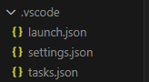

# Step02

> <span style="color: red;">**IMPORTANTE!!**</span> iDurante lo sviluppo ho aggiunto il file `settings.json` per configurare correttamente l’IntelliSense di VS Code.
> <div align="center">
> 
> 
> 
> </div>
>
> ```json
> {
>    "C_Cpp.default.compileCommands": "${workspaceFolder}/build/> compile_commands.json"
> }
> ```
> Questa impostazione è fondamentale per permettere all’editor di utilizzare le stesse opzioni di compilazione di CMake, garantendo il riconoscimento corretto di include, costanti, macro e simboli del progetto.
> 
> **Nota**: un utente che scarica il gioco per eseguirlo o compilarlo **non deve effettuare questa configurazione**: è richiesta solo agli sviluppatori per avere il supporto completo dell’editor.