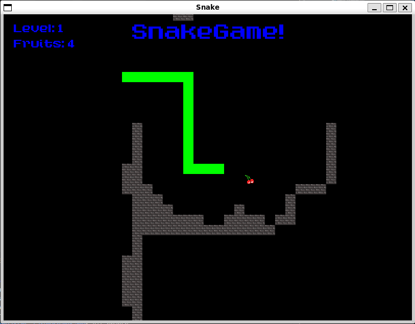

# Step03 - Sistema UI Avanzato e Sprite Casuali

Questo step estende le funzionalità di step02 introducendo un sistema di interfaccia utente dinamica e sprite casuali per la frutta, trasformando il gioco in un'esperienza più ricca e visivamente accattivante.



## 🆕 Nuove Funzionalità

### 🎨 **Sistema Sprite Casuali per Frutta**
- Texture spritesheet con 3 varianti di frutta (48x16px, 3 sprite da 16x16px)
- Selezione casuale della sprite ad ogni generazione di frutta
- Sistema di texture condivisa ottimizzato per performance
- Integrazione con generatori casuali thread-safe

### 📊 **Sistema UI Dinamico**
- Interfaccia utente che segue la telecamera
- Display in tempo reale di livello corrente e frutti raccolti
- Posizionamento intelligente del testo rispetto alla viewport
- Font personalizzato caricato dinamicamente

### 🎥 **Telecamera Migliorata**
- Separazione logica gestione telecamera in `cameraHandler.cpp`
- Sincronizzazione automatica UI-telecamera
- Smooth following ottimizzato per 60 FPS

## 📁 Struttura del Progetto

```
mySnakeGame/
├── CMakeLists.txt              # Build + copia automatica resources/
├── build/                      # Directory di build con resources/
│   ├── step03                  # Eseguibile avanzato
│   └── resources/              # Risorse con nuove texture
├── resources/                  # Risorse estese
│   ├── fonts/                  # Font personalizzati
│   │   └── A_Goblin_Appears.otf # Font principale UI
│   ├── levels/                 # Mappe di gioco
│   │   ├── levels.txt          # Lista dei livelli
│   │   └── Level01.png         # Mappa pixel-based
│   └── texture/                # Texture per oggetti
│       ├── wall.png            # Texture dei muri
│       └── fruit.png           # NEW: Spritesheet 48x16 (3 sprite)
└── step03/                     # Implementazione avanzata
    ├── headers/                # File header (.hpp)
    │   ├── engine.hpp          # Engine con UI system
    │   ├── snake.hpp           # Snake base (invariato)
    │   ├── fruit.hpp           # NEW: Classe con sprite casuali
    │   └── wall.hpp            # Wall system (invariato)
    ├── src/                    # Implementazioni base (.cpp)
    │   ├── main.cpp            # Entry point
    │   ├── engine.cpp          # Engine + font loading
    │   ├── snake.cpp           # Snake base
    │   ├── fruit.cpp           # NEW: Sistema sprite casuali
    │   └── wall.cpp            # Wall implementation
    └── functionHandler/        # Handler specializzati
        └── engineHandler/      # Funzioni del motore di gioco
            ├── input.cpp       # Gestione input
            ├── update.cpp      # Logica + UI updates
            ├── draw.cpp        # Rendering + UI drawing
            ├── snakeFunction.cpp # Snake management
            ├── fruitFunction.cpp # Frutta + randomizzazione
            ├── levelHandler.cpp  # Level management
            ├── togglePauseFunction.cpp # Sistema pausa
            ├── cameraHandler.cpp # NEW: Gestione telecamera
            └── textHandler.cpp   # NEW: Sistema UI completo
```

## 🧩 Novità Principali

### `Fruit.hpp/.cpp` - Sistema Sprite Casuali
La classe `Fruit` è stata completamente riscritta per supportare sprite casuali invece di semplici rettangoli colorati.

**Nuovi Attributi:**
```cpp
class Fruit {
private:
    unique_ptr<Sprite> sprite;          // Sprite grafica (16x16 scalata 1.25x)
    static Texture texture;             // Texture condivisa (Singleton pattern)
    static bool textureLoaded;          // Flag caricamento lazy
    int currentSpriteIndex;             // Indice sprite corrente (0-2)
    random_device rd;                   // Seed hardware casualità
    mt19937 gen;                        // Generatore Mersenne Twister
    uniform_int_distribution<> dis;     // Distribuzione uniforme [0,2]
```

**Nuove Funzioni:**
- **`randomizeSprite()`**: Seleziona casualmente una delle 3 sprite disponibili
- **`loadTexture()`**: Caricamento lazy della texture condivisa
- **`getSprite()`**: Ritorna riferimento alla sprite (performance ottimizzata)

**Algoritmo Selezione Sprite:**
```cpp
void Fruit::randomizeSprite() {
    currentSpriteIndex = dis(gen);  // 0, 1, o 2
    
    // Ogni sprite è 16x16, disposte orizzontalmente
    IntRect textureRect(Vector2i(currentSpriteIndex * 16, 0), Vector2i(16, 16));
    sprite->setTextureRect(textureRect);
}
```

**Compatibilità SFML 3.0:**
- **Costruttore**: `unique_ptr<Sprite>` per gestire costruttore che richiede texture
- **Scaling**: `setScale(Vector2f(1.25f, 1.25f))` invece di parametri separati
- **TextureRect**: `IntRect(Vector2i, Vector2i)` per compatibilità API 3.0

### `textHandler.cpp` - Sistema UI Completo
Nuovo modulo dedicato alla gestione dell'interfaccia utente dinamica.

**Funzioni Principali:**
```cpp
// Setup iniziale testi con font personalizzato
void setupText(Text *textItem, const Font &font, const string &value, int size, Color color);

// Posizionamento testi relativo alla telecamera
void updateTextPosition();

// Aggiornamento contenuti dinamici
void updateTextContent();

// Configurazione iniziale completa
void fixText();
```

**Sistema Posizionamento Dinamico:**
```cpp
void Engine::updateTextPosition() {
    Vector2f cameraCenter = camera.getCenter();
    
    // Titolo centrato orizzontalmente
    FloatRect titleTextBounds = titleText.getLocalBounds();
    float titleX = cameraCenter.x - (titleTextBounds.size.x / 2.0f);
    float titleY = cameraCenter.y - (WINDOW_HEIGHT / 2.0f) + 20.0f;
    titleText.setPosition(Vector2f(titleX, titleY));
    
    // UI laterale sinistra con margine fisso
    float leftMargin = 20.0f;
    float currentLevelX = cameraCenter.x - (WINDOW_WIDTH / 2.0f) + leftMargin;
    // Posizionamento Y progressivo per elementi UI
}
```

**Elementi UI Dinamici:**
- **titleText**: "SnakeGame!" centrato in alto (28px, blu)
- **currentLevelText**: "Level: X" angolo alto-sinistra (15px, blu)
- **fruitEatenText**: "Fruits: X" sotto il livello (15px, blu)

### `cameraHandler.cpp` - Gestione Telecamera Separata
Separazione logica della gestione telecamera per maggiore modularità.

**Funzioni Specializzate:**
- **`initializeCamera()`**: Setup iniziale telecamera + sincronizzazione UI
- **`updateCamera()`**: Aggiornamento fluido telecamera + UI seguente

**Sincronizzazione UI-Telecamera:**
```cpp
void Engine::updateCamera() {
    // ... logica telecamera esistente ...
    
    camera.setCenter(newCenter);
    window.setView(camera);
    
    // Sincronizzazione automatica UI
    updateTextPosition();  // UI segue sempre la telecamera
}
```

### Aggiornamenti Engine

#### `engine.hpp/.cpp` - Font Loading e UI Management
**Nuovi Attributi:**
```cpp
Font mainFont;                  // Font personalizzato caricato da file
Text titleText;                 // Titolo del gioco
Text fruitEatenText;            // Contatore frutti raccolti
Text currentLevelText;          // Indicatore livello corrente
```

**Font Loading Avanzato:**
```cpp
// Caricamento font con fallback automatico
Engine::Engine() : mainFont([]() { 
    Font f; 
    if (!f.openFromFile("resources/fonts/A_Goblin_Appears.otf")) {
        std::cerr << "Warning: Could not load custom font, using default" << std::endl;
    }
    return f; 
}()), titleText(mainFont), currentLevelText(mainFont), fruitEatenText(mainFont)
```

#### `fruitFunction.cpp` - Integrazione Sprite Casuali
**Modifiche al Posizionamento:**
```cpp
void Engine::moveFruit() {
    // ... logica posizionamento esistente ...
    
    fruit.setPosition(newFruitLocation);
    fruit.randomizeSprite();  // NEW: Randomizza sprite ogni movimento
}
```

#### `update.cpp` - Aggiornamenti UI in Tempo Reale
**Sincronizzazione Automatica:**
```cpp
// Quando il serpente mangia frutta
if(snake[0].getShape().getGlobalBounds().findIntersection(fruit.getSprite().getGlobalBounds())) {
    fruitEatenThisLevel += 1;
    fruitEatenTotal += 1;
    updateTextContent();  // NEW: Aggiorna UI immediatamente
    // ...
}
```

#### `draw.cpp` - Rendering UI Completo
**Pipeline Rendering Estesa:**
```cpp
void Engine::draw() {
    // ... rendering esistente ...
    
    // NEW: Draw UI Layer
    window.draw(titleText);
    window.draw(currentLevelText);  
    window.draw(fruitEatenText);
}
```

## ⚙️ Miglioramenti Tecnici

### Performance Optimizations
- **Texture Sharing**: Una sola texture caricata per tutti i frutti
- **Smart Pointers**: `unique_ptr<Sprite>` per gestione memoria automatica
- **Lazy Loading**: Texture e font caricati solo quando necessario
- **UI Batching**: Aggiornamento UI solo quando necessario (movimento telecamera)

### SFML 3.0 Compatibility
- **API Updates**: Tutti i metodi aggiornati per SFML 3.0
  - `loadFromFile()` invece di `openFromFile()`
  - `Vector2f` per `setScale()` invece di parametri separati
  - `IntRect` con costruttore `Vector2i` based

### Thread Safety
- **Random Generation**: Generatori thread-safe per sprite casuali
- **Static Members**: Gestione sicura texture condivise

## 🆚 Differenze da Step02

| Funzionalità | Step02 | Step03 |
|-------------|--------|--------|
| **Frutta** | RectangleShape rosso | Sprite casuali da texture |
| **UI System** | Nessuna interfaccia | UI dinamica completa |
| **Font** | Font di sistema | Font personalizzato caricato |
| **Telecamera** | Gestione monolitica | Handler separato + UI sync |
| **Texture Management** | Solo muri | Muri + frutti con pattern Singleton |
| **Randomization** | Solo posizione frutta | Posizione + sprite casuali |
| **Modularità** | Tutto in engine.cpp | Handler specializzati |
| **Performance** | Base | Ottimizzazioni texture condivise |

## 🎮 Nuove Esperienze di Gioco

### Varietà Visuale
- **3 Tipi di Frutta**: Ogni frutta generata mostra una sprite diversa casualmente
- **Feedback Visivo**: UI in tempo reale per progressi e statistiche
- **Font Artistico**: Esperienza visiva più coinvolgente

### Interfaccia Informativa
- **Progresso Chiaro**: Contatori frutti e livello sempre visibili
- **Design Responsive**: UI si adatta automaticamente al movimento telecamera
- **Leggibilità**: Contrasto e dimensioni ottimizzate per gameplay

## 🏁 Compilazione e Esecuzione

### Build Standard
```bash
# Configurazione
cmake -S . -B build -DCMAKE_EXPORT_COMPILE_COMMANDS=ON

# Compilazione con copia automatica resources/ (include nuove texture e font)
cmake --build build -j

# Esecuzione 1
./build/step03

# Esecuzione 2
cd build && ./step03
```

### Requisiti Texture
- **fruit.png**: 48x16 pixel, 3 sprite orizzontali da 16x16
- **A_Goblin_Appears.otf**: Font per UI system

## 🔧 Configurazione Sviluppatori

Per sviluppatori che modificano il codice, la stessa configurazione VS Code di step02 rimane valida:

```json
{
   "C_Cpp.default.compileCommands": "${workspaceFolder}/build/compile_commands.json"
}
```
