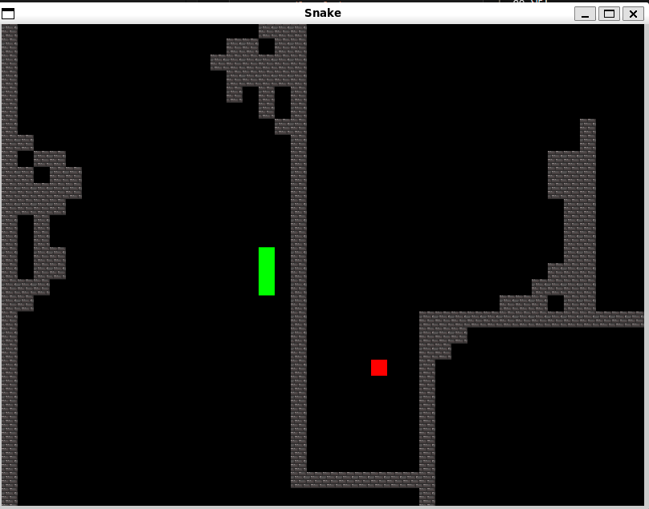

# Step02 - Sistema di Livelli, Telecamera Dinamica e Gestione Avanzata

Questo step introduce funzionalità avanzate per trasformare il snake base in un'esperienza di gioco completa con mappe personalizzabili, telecamera fluida e sistema di collisioni avanzato.



## 🆕 Nuove Funzionalità

### 📍 **Sistema di Livelli da Immagini**
- Caricamento automatico di mappe da file PNG
- Pixel-based level design (nero=muro, rosso=spawn snake)
- Sistema modulare per aggiungere nuovi livelli

### 🎥 **Telecamera Dinamica**
- Seguimento fluido dello snake con interpolazione
- Limiti intelligenti per evitare visualizzazione oltre i bordi della mappa
- Movimento smooth a 60 FPS indipendente dal movimento del serpente

### 🏗️ **Gestione Muri e Collisioni**
- Sistema di muri basato su texture condivise
- Collisioni precise snake-muro
- Ottimizzazione memory con pattern Singleton per texture

### 🔄 **Miglioramenti Engine**
- Posizionamento frutta su tutta la mappa (non limitato alla finestra)
- Snake spawn automatico dal pixel rosso della mappa
- Gestione errori robusta per file mancanti

## 📁 Struttura del Progetto

```
mySnakeGame/
├── CMakeLists.txt              # Build + copia automatica resources/
├── build/                      # Directory di build con resources/
│   ├── step02                  # Eseguibile (funziona da qui!)
│   └── resources/              # Copia automatica delle risorse
├── resources/                  # Risorse del gioco
│   ├── levels/                 # Mappe di gioco
│   │   ├── levels.txt          # Lista dei livelli
│   │   └── Level01.png         # Mappa pixel-based
│   └── texture/                # Texture per oggetti
│       ├── wall.png            # Texture dei muri
│       └── fruit.png           # Texture della frutta
└── step02/                     # Implementazione avanzata
    ├── headers/                # File header (.hpp)
    │   ├── engine.hpp          # Engine con telecamera e livelli
    │   ├── snake.hpp           # Snake base (invariato)
    │   ├── fruit.hpp           # Fruit base (invariato)
    │   └── wall.hpp            # Nuova classe Wall
    ├── src/                    # Implementazioni base (.cpp)
    │   ├── main.cpp            # Entry point
    │   ├── engine.cpp          # Engine + funzioni telecamera
    │   ├── snake.cpp           # Snake base
    │   ├── fruit.cpp           # Fruit base
    │   └── wall.cpp            # Implementazione Wall
    └── functionHandler/        # Handler specifici
        └── engineHandler/      # Funzioni del motore di gioco
            ├── input.cpp       # Gestione input
            ├── update.cpp      # Logica + collisioni muri
            ├── draw.cpp        # Rendering
            ├── snakeFunction.cpp # Snake + spawn da pixel rosso
            ├── fruitFunction.cpp # Frutta + posizionamento mappa
            ├── levelHandler.cpp  # Caricamento e parsing livelli
            └── togglePauseFunction.cpp # Sistema pausa
```

## 🧩 Classi Principali

### `Engine.hpp/.cpp` - Motore Avanzato
Il motore è stato esteso con sistema di livelli, telecamera dinamica e gestione avanzata delle risorse.

**Nuovi Attributi:**
```cpp
// Sistema Telecamera
View camera;                    // Telecamera SFML per seguimento
Vector2f snakeStartPosition;    // Spawn point da pixel rosso
Vector2u mapSize;              // Dimensioni mappa in pixel

// Sistema Livelli  
vector<Wall> wallSection;      // Muri della mappa corrente
vector<string> levels;         // Lista file livelli
int currentLevel;              // Livello attuale
int maxLevels;                 // Numero livelli disponibili
```

**Nuove Funzioni Chiave:**
- **`checkLevelFiles()`**: Scansiona `resources/levels/levels.txt` per livelli disponibili
- **`loadLevel(int)`**: Carica mappa da PNG, parsing pixel-by-pixel
- **`initializeCamera()`**: Setup telecamera iniziale centrata su snake
- **`updateCamera()`**: Aggiornamento fluido telecamera con limiti mappa

**Algoritmo Caricamento Livelli:**
```cpp
// Parsing pixel-based della mappa
for (unsigned y = 0; y < size.y; ++y) {
    for (unsigned x = 0; x < size.x; ++x) {
        const sf::Color c = img.getPixel({x, y});
        sf::Vector2f pos(x * TILE, y * TILE);  // 20px per tile
        
        if (c == BLACK) {
            wallSection.emplace_back(Wall(pos, {TILE, TILE}));
        } else if (c == RED) {
            snakeStartPosition = pos;  // Spawn point snake
        }
    }
}
```

**Sistema Telecamera Fluida:**
```cpp
void Engine::updateCamera() {
    Vector2f snakeHeadPosition = snake[0].getPosition();
    Vector2f targetCenter = snakeHeadPosition + Vector2f(10.f, 10.f);
    
    // Smooth interpolation
    float smoothFactor = 0.08f;  // Controllo fluidità
    Vector2f newCenter = currentCenter + (targetCenter - currentCenter) * smoothFactor;
    
    // Limiti mappa - evita sfondo nero
    float halfWidth = WINDOW_WIDTH / 2.0f;
    float halfHeight = WINDOW_HEIGHT / 2.0f;
    float mapWidthPixels = mapSize.x * 20.0f;
    float mapHeightPixels = mapSize.y * 20.0f;
    
    newCenter.x = std::max(halfWidth, std::min(newCenter.x, mapWidthPixels - halfWidth));
    newCenter.y = std::max(halfHeight, std::min(newCenter.y, mapHeightPixels - halfHeight));
    
    camera.setCenter(newCenter);
}
```

### `Wall.hpp/.cpp` - Sistema Muri Ottimizzato
Nuova classe per gestire i muri della mappa con pattern Singleton per ottimizzazione memoria.

**Design Pattern Applicato:**
- **Singleton Texture**: Una sola texture condivisa tra tutti i muri
- **Lazy Loading**: Texture caricata solo al primo utilizzo
- **Memory Optimization**: Evita caricate multiple della stessa texture

**Attributi:**
```cpp
class Wall {
private:
    RectangleShape wallShape;           // Forma grafica individuale
    static Texture wallTexture;        // Texture condivisa (Singleton)
    static bool textureLoaded;         // Flag di caricamento
public:
    static void loadWallTexture();     // Caricamento lazy texture
};
```

**Gestione Memoria Intelligente:**
```cpp
Wall::Wall(Vector2f position, Vector2f size) {
    wallShape.setSize(size);
    wallShape.setPosition(position);
    
    loadWallTexture();  // Carica texture solo se necessario
    
    if (textureLoaded && wallTexture.getSize().x > 0) {
        wallShape.setTexture(&wallTexture);  // Riferimento a texture statica
    } else {
        wallShape.setFillColor(Color::White);  // Fallback colore
    }
}
```

### Aggiornamenti Classi Esistenti

#### `Snake.hpp/.cpp` - Spawn Dinamico
**Modifiche:**
- **Spawn intelligente**: Posizione iniziale dal pixel rosso della mappa invece di hardcoded
- **Direzione automatica**: Snake spawna guardando verso destra con 3 sezioni allineate

**Nuovo Algoritmo Spawn:**
```cpp
void Engine::newSnake() {
    snake.clear();
    // Usa posizione trovata nel parsing della mappa
    snake.emplace_back(snakeStartPosition);                           // Testa
    snake.emplace_back(Vector2f(snakeStartPosition.x - 20, snakeStartPosition.y));  // Corpo
    snake.emplace_back(Vector2f(snakeStartPosition.x - 40, snakeStartPosition.y));  // Coda
}
```

#### `Fruit.hpp/.cpp` - Posizionamento Mappa Completa
**Miglioramenti:**
- **Area spawn estesa**: Non limitato alla finestra 800x600, usa dimensioni mappa reali
- **Anti-collision avanzato**: Evita spawn su snake E muri
- **Grid alignment**: Posizionamento preciso su griglia 20x20px

**Algoritmo Posizionamento Avanzato:**
```cpp
void Engine::moveFruit() {
    // Usa dimensioni mappa reali invece di finestra
    sf::Vector2f fruitResolution(
        static_cast<float>(mapSize.x) - 2.f,
        static_cast<float>(mapSize.y) - 2.f  
    );
    
    do {
        badLocation = false;
        newFruitLocation.x = (1 + rand()) * 20;  // Griglia 20px
        newFruitLocation.y = (1 + rand()) * 20;
        
        // Check collisione snake
        for(auto & s : snake) { /* ... */ }
        
        // Check collisione muri (NUOVO!)
        for(auto & w : wallSection) {
            if(w.getShape().getGlobalBounds().findIntersection(fruitRect)) {
                badLocation = true;
                break;
            }
        }
    } while (badLocation);
}
```

## 📋 Handler Specializzati

### `levelHandler.cpp` - Gestione Livelli
**Funzioni principali:**
- **`checkLevelFiles()`**: Parsing di `levels.txt`, validazione file esistenti
- **`loadLevel(int)`**: Caricamento PNG, conversione pixel→oggetti, setup mappa

**Formato File Supportato:**
```
resources/levels/levels.txt:
Level01.png
Level02.png
...
```

### `update.cpp` - Logica di Gioco Estesa
**Nuove Collisioni:**
```cpp
// Collisione muri (aggiunta)
for(auto & wall : wallSection) {
    if(snake[0].getShape().getGlobalBounds().findIntersection(wall.getShape().getGlobalBounds())) {
        currentGameState = GAMEOVER;
    }
}
```

**Telecamera Fluida:**
- Aggiornamento telecamera ogni frame (60 FPS) invece che solo al movimento snake
- Interpolazione smooth per eliminare scatti

## ⚙️ Requisiti Tecnici

- **CMake**: >= 3.28 
- **Compiler**: Clang/Clang++ con supporto C++17
- **SFML**: 3.0.0 (scaricato automaticamente via FetchContent)
- **Sistema Operativo**: Linux con supporto Threads

## 🏁 Compilazione e Esecuzione

### Build Standard
```bash
# Configurazione (genera anche compile_commands.json per VS Code)
cmake -S . -B build -DCMAKE_EXPORT_COMPILE_COMMANDS=ON

# Compilazione con copia automatica resources/
cmake --build build -j

# Esecuzione - ENTRAMBI i modi funzionano!
./step02                # Dalla directory build/
# OPPURE  
./build/step02          # Dalla directory principale
```

### Funzionalità CMake Avanzate
Il sistema di build copia automaticamente `resources/` in `build/` permettendo esecuzione da entrambe le directory:

```cmake
# Copia automatica risorse
file(COPY ${CMAKE_SOURCE_DIR}/resources DESTINATION ${CMAKE_BINARY_DIR})

# Target per aggiornamento continuo
add_custom_target(copy_resources ALL
    COMMAND ${CMAKE_COMMAND} -E copy_directory
    ${CMAKE_SOURCE_DIR}/resources ${CMAKE_BINARY_DIR}/resources
    COMMENT "Copying resources to build directory"
)
```

## 🎮 Come Giocare

1. **Avvio**: Il serpente spawna automaticamente dal pixel rosso della mappa
2. **Movimento**: Frecce direzionali per controllare il serpente
3. **Obiettivo**: Raccogli la frutta (rossa) esplorando la mappa
4. **Telecamera**: Segue automaticamente il serpente con movimento fluido
5. **Collisioni**: Evita muri (bianchi/texture) e il corpo del serpente

## 🔧 Configurazione VS Code

> <span style="color: red;">**IMPORTANTE!!**</span> Per sviluppatori che modificano il codice:

```json
{
   "C_Cpp.default.compileCommands": "${workspaceFolder}/build/compile_commands.json"
}
```

Questa configurazione permette a VS Code di utilizzare le stesse opzioni di compilazione di CMake per IntelliSense accurato.

## 🆚 Differenze da Step01

| Funzionalità | Step01 | Step02 |
|-------------|--------|--------|
| **Mappa** | Finestra fissa 800x600 | Mappe PNG personalizzabili |
| **Spawn Snake** | Posizione hardcoded | Pixel rosso automatico |
| **Telecamera** | Statica | Dinamica con limiti |
| **Muri** | Bordi finestra | Sistema completo con texture |
| **Frutta** | Area finestra | Intera mappa |
| **Collisioni** | Solo bordi | Muri + corpo serpente |
| **Build System** | Base | Con copia automatica resources |
| **Esecuzione** | Solo da root | Da build/ o root/ |