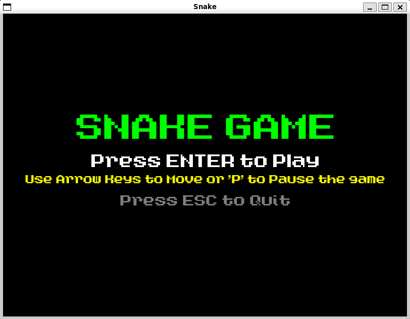
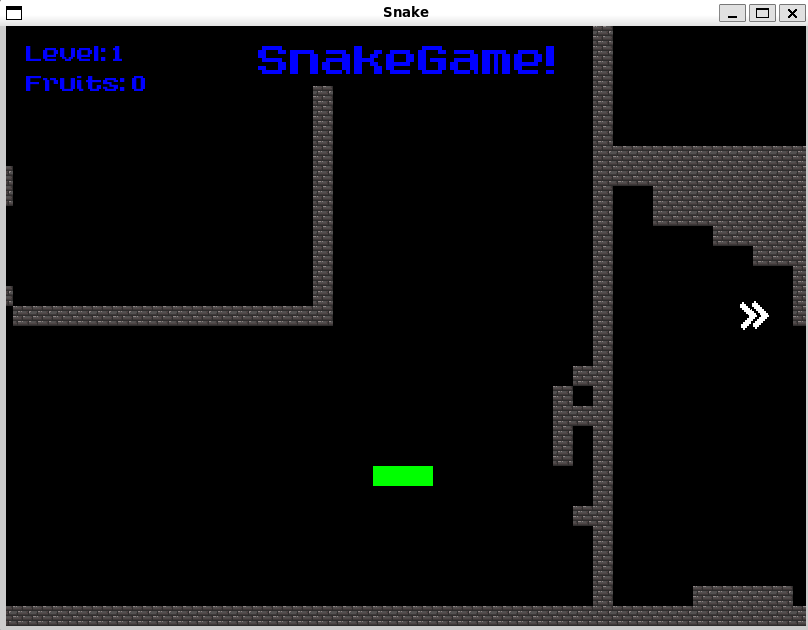
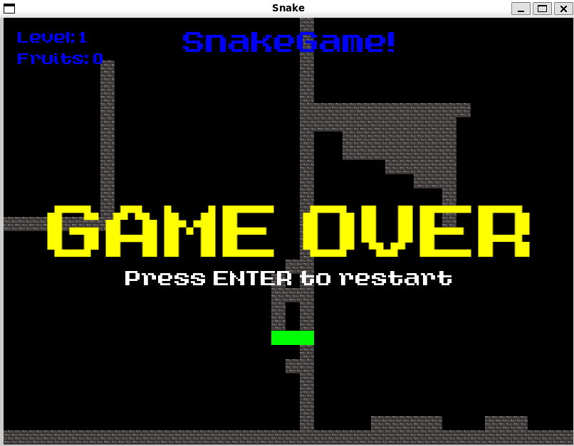

# Step04 - Sistema UI Completo e Navigazione Avanzata

Questo step trasforma completamente l'esperienza di gioco di step03, introducendo un sistema completo di interfaccia utente, gestione stati avanzata e strumenti di navigazione intelligenti, elevando il progetto da prototipo a gioco completo e professionale.

<table>
  <tr>
    <td align="center">
      
      <br><b>🎮 Menu Principale</b>
      <br><i>Nuovo menu di avvio con istruzioni</i>
    </td>
    <td align="center">
      
      <br><b>🧭 Freccia Direzionale + Contatori</b>
      <br><i>Guida animata verso il frutto e contatori</i>
    </td>
  </tr>
  <tr>
    <td align="center">
      
      <br><b>😵 Game Over</b>
      <br><i>Interfaccia elegante con restart</i>
    </td>
    <td align="center">
      
      <br><b>⏸️ Sistema di Pausa</b>
      <br><i>Popup elegante con overlay</i>
    </td>
  </tr>
</table>

## 🆕 Nuove Funzionalità

### 🎮 **Sistema di Menu Principale**
- Menu di avvio professionale con titolo stilizzato "SNAKE GAME"
- Controlli intuitivi: ENTER per giocare, ESC per uscire
- Istruzioni integrate sempre visibili per guidare l'utente
- Transizioni fluide tra menu e gameplay
- Design responsive centrato sulla finestra

### ⏸️ **Sistema di Pausa Avanzato**
- Popup di pausa con overlay semi-trasparente
- Attivazione/disattivazione con tasto **P** durante il gameplay
- Interfaccia elegante con box centrato e istruzioni chiare
- Ripresa del gioco senza perdita di stato o posizione
- Background del gioco visibile attraverso l'overlay

### 🏆 **Gestione Livelli e Progressione**
- Sistema di avanzamento automatico al raggiungimento di **8 frutti** per livello
- Popup di successo livello con opzioni continue/quit
- Controlli dedicati: **ENTER** per continuare, **ESC** per menu
- Reset intelligente delle variabili tra livelli mantenendo velocità progressiva
- Gestione completa quando si raggiunge l'ultimo livello disponibile

### 💀 **Interfaccia Game Over Migliorata**
- Schermata Game Over con testo centrato e stilizzato
- Opzione di restart immediato con **ENTER**
- Ritorno al menu principale con **ESC**
- Preservazione statistiche durante la sessione di gioco
- Design consistente con il resto dell'UI

### 🧭 **Sistema di Freccia Direzionale (NUOVO!)**
- Freccia animata che indica la direzione esatta del frutto
- Animazione fluida con 3 frame (16x16px) scalati a 32x32px
- Posizionamento intelligente ai margini della camera view
- Visibilità condizionale: appare solo quando il frutto è fuori vista
- Rotazione dinamica in tempo reale verso la posizione del frutto
- Performance ottimizzate con aggiornamenti solo quando necessario

## 📁 Struttura del Progetto

```
mySnakeGame/
├── CMakeLists.txt              # Build + copia automatica resources/
├── build/                      # Directory di build con resources/
│   ├── step04                  # Eseguibile completo
│   └── resources/              # Risorse con nuove texture
├── resources/                  # Risorse estese
│   ├── fonts/                  # Font personalizzati
│   │   └── A_Goblin_Appears.otf # Font principale UI
│   ├── levels/                 # Mappe di gioco
│   │   ├── levels.txt          # Lista dei livelli
│   │   ├── Level01.png         # Mappa livello 1
│   │   └── Level02.png         # NEW: Mappa livello 2
│   ├── texture/                # Texture per oggetti
│   │   ├── wall.png            # Texture dei muri
│   │   ├── fruit.png           # Spritesheet frutti (3 sprite)
│   │   └── arrow.png           # NEW: Sprite freccia direzionale (3 frame)
│   └── documentationImg/       # Screenshot per documentazione
│       ├── step04-menu.png     # Screenshot menu
│       ├── step04-gameplay.png # Screenshot gameplay
│       ├── step04-pause.png    # Screenshot pausa
│       └── step04-gameover.png # Screenshot game over
└── step04/                     # Implementazione completa
    ├── headers/                # File header (.hpp)
    │   ├── engine.hpp          # Engine con sistema stati completo
    │   ├── snake.hpp           # Snake base (invariato)
    │   ├── fruit.hpp           # Sistema sprite casuali (da step03)
    │   └── wall.hpp            # Wall system (invariato)
    ├── src/                    # Implementazioni base (.cpp)
    │   ├── main.cpp            # Entry point
    │   ├── engine.cpp          # Engine + inizializzazione completa
    │   ├── snake.cpp           # Snake base
    │   ├── fruit.cpp           # Sistema sprite casuali
    │   └── wall.cpp            # Wall implementation
    └── functionHandler/        # Handler specializzati
        └── engineHandler/      # Funzioni del motore di gioco
            ├── input.cpp       # Gestione input contestuale per tutti gli stati
            ├── update.cpp      # Logica + aggiornamenti freccia
            ├── draw.cpp        # Rendering + freccia direzionale
            ├── snakeHandler.cpp # Snake management (rinominato)
            ├── fruitHandler.cpp # Frutta + randomizzazione (rinominato)
            ├── levelHandler.cpp # Level management + progressione
            ├── togglePauseHandler.cpp # Sistema pausa (rinominato)
            ├── cameraHandler.cpp # Gestione telecamera (da step03)
            ├── textHandler.cpp # Sistema UI completo + popup
            └── directionArrowHandler.cpp # NEW: Gestione freccia direzionale
```

## 🧩 Novità Principali

### `directionArrowHandler.cpp` - Sistema Freccia Direzionale (NUOVO!)
Modulo completamente nuovo per la gestione della freccia direzionale animata.

**Funzionalità Principali:**
```cpp
class Engine {
private:
    Texture arrowTexture;           // Texture freccia (48x16px, 3 frame)
    Sprite arrowSprite;             // Sprite freccia scalata 2x
    int currentArrowFrame;          // Frame animazione corrente (0-2)
    Time arrowAnimationTimer;       // Timer per animazione fluida
    const float ARROW_ANIMATION_SPEED = 0.2f; // 5 FPS animazione
    const float ARROW_MARGIN = 50.0f;         // Distanza da bordo camera
```

**Nuove Funzioni:**
- **`setupDirectionArrow()`**: Inizializzazione texture, sprite e parametri animazione
- **`updateDirectionArrow()`**: Aggiornamento animazione e posizionamento in tempo reale
- **`drawDirectionArrow()`**: Rendering condizionale (solo se frutto fuori vista)
- **`calculateArrowPosition()`**: Calcolo matematico posizione ai margini camera
- **`calculateArrowRotation()`**: Calcolo angolo rotazione verso frutto (trigonometria)

**Algoritmo Posizionamento Intelligente:**
```cpp
Vector2f Engine::calculateArrowPosition(Vector2f snakePos, Vector2f fruitPos) {
    Vector2f cameraCenter = camera.getCenter();
    Vector2f direction = fruitPos - snakePos;
    
    // Normalizzazione direzione
    float length = sqrt(direction.x * direction.x + direction.y * direction.y);
    if (length > 0) direction /= length;
    
    // Calcolo intersezione con bordi camera
    float scaleX = (WINDOW_WIDTH/2 - ARROW_MARGIN) / abs(direction.x);
    float scaleY = (WINDOW_HEIGHT/2 - ARROW_MARGIN) / abs(direction.y);
    float scale = min(scaleX, scaleY);
    
    return cameraCenter + direction * scale;
}
```

### `textHandler.cpp` - Sistema UI Completo Esteso
Estensione massiva del sistema UI di step03 con popup e menu completi.

**Nuovi Elementi UI:**
```cpp
// Menu principale (NUOVO)
Text menuTitle, playText, quitText, instructionsText;

// Sistema popup di pausa (NUOVO)
RectangleShape pauseOverlay, pauseBox;
Text pauseTitle, pauseInstruction1, pauseInstruction2;

// Sistema popup successo livello (NUOVO)  
RectangleShape successOverlay, successBox;
Text successTitle, successInstruction1, successInstruction2;
```

**Nuove Funzioni Specializzate:**
- **`setupMenu()`**: Configurazione menu principale con testi centrati
- **`updateMenuPosition()`**: Posizionamento responsivo elementi menu
- **`drawMenu()`**: Rendering completo schermata menu
- **`setupPausePopup()`**: Inizializzazione popup pausa con overlay
- **`updatePausePopupPosition()`**: Posizionamento dinamico rispetto camera
- **`drawPausePopup()`**: Rendering popup con effetti trasparenza
- **`setupSuccessLevelPopup()`**: Setup popup avanzamento livello
- **`updateSuccessLevelPopupPosition()`**: Posizionamento intelligente popup
- **`drawSuccessLevelPopup()`**: Rendering popup successo

**Sistema Popup Avanzato:**
```cpp
void Engine::setupPausePopup() {
    // Overlay semi-trasparente full-screen
    pauseOverlay.setSize(Vector2f(WINDOW_WIDTH, WINDOW_HEIGHT));
    pauseOverlay.setFillColor(Color(0, 0, 0, 128)); // 50% trasparenza
    
    // Box popup centrato con bordo
    pauseBox.setSize(Vector2f(500, 300));
    pauseBox.setFillColor(Color(50, 50, 50, 220)); // Quasi opaco
    pauseBox.setOutlineThickness(3);
    pauseBox.setOutlineColor(Color::White);
}
```

### `input.cpp` - Gestione Input Contestuale Avanzata
Gestione input completamente ridisegnata per supportare tutti gli stati di gioco.

**Stati Supportati:**
```cpp
enum GameState { 
    MENU,           // NUOVO: Menu principale
    RUNNING,        // Gameplay normale (da step03)
    PAUSED,         // NUOVO: Popup pausa avanzato
    GAMEOVER,       // NUOVO: Interfaccia game over completa
    LEVEL_SUCCESS   // NUOVO: Popup avanzamento livello
};
```

**Logica Input Contextual:**
```cpp
void Engine::input() {
    // Menu principale
    if (currentGameState == GameState::MENU) {
        if (e.scancode == sf::Keyboard::Scancode::Enter) startGame();
        if (e.scancode == sf::Keyboard::Scancode::Escape) window.close();
    }
    
    // Popup successo livello
    if (currentGameState == GameState::LEVEL_SUCCESS) {
        if (e.scancode == sf::Keyboard::Scancode::Enter) {
            beginNextLevel();
            currentGameState = GameState::RUNNING;
        }
        if (e.scancode == sf::Keyboard::Scancode::Escape) {
            currentGameState = GameState::MENU;
        }
    }
    
    // ... gestione altri stati ...
}
```

### `levelHandler.cpp` - Gestione Avanzata Livelli
Estensione del sistema livelli con progressione automatica e reset intelligente.

**Nuova Funzione:**
```cpp
void Engine::beginNextLevel() {
    currentLevel += 1;
    wallSection.clear();
    direction.clear();
    
    // Velocità progressiva mantenuta
    speed = 2 + currentLevel;
    snakeDirection = Direction::RIGHT;
    sectionToAdd = 0;
    fruitEatenThisLevel = 0;  // Reset contatore livello
    
    loadLevel(currentLevel);
    newSnake();
    moveFruit();
    updateTextContent();      // Aggiornamento UI immediato
}
```

### `update.cpp` - Logica Avanzamento Livello
Integrazione della logica di controllo avanzamento livello.

**Controllo Automatico Avanzamento:**
```cpp
// Collision detection - Fruit
if(snake[0].getShape().getGlobalBounds().findIntersection(fruit.getSprite().getGlobalBounds())) {
    fruitEatenThisLevel += 1;
    fruitEatenTotal += 1;
    updateTextContent(); // Aggiornamento UI immediato
    
    bool beginningNewLevel = false;
    if(fruitEatenThisLevel >= 8) {  // Soglia step04: 8 frutti
        if(currentLevel < maxLevels) {
            beginningNewLevel = true;
            currentGameState = GameState::LEVEL_SUCCESS;  // Popup successo
        } else {
            currentGameState = GAMEOVER;  // Tutti i livelli completati
            beginningNewLevel = true;
        }
    }
    
    if(!beginningNewLevel) {
        sectionToAdd += 4;
        speed++;
        moveFruit();
    }
}

// NEW: Aggiornamento freccia direzionale
updateDirectionArrow();
```

### `engine.hpp/.cpp` - Sistema Stati Completo
Estensione architetturale per supportare tutti i nuovi stati e funzionalità.

**Inizializzazione Completa:**
```cpp
Engine::Engine() : /* ... inizializzazione step03 ... */,
                  arrowSprite(arrowTexture), currentArrowFrame(0), arrowAnimationTimer(Time::Zero) {
    // ... setup esistente ...
    
    window.setVerticalSyncEnabled(true); // Anti-glitch rendering
    
    currentGameState = GameState::MENU;  // Avvio da menu
    setupMenu();
    setupSuccessLevelPopup();
    setupPausePopup();
    setupDirectionArrow();               // NEW: Setup freccia
    
    fixText();
}
```

**Loop Principale Ottimizzato:**
```cpp
void Engine::run() {
    while(window.isOpen()) {
        if(currentGameState == GameState::MENU) {
            input();
            drawMenu();
            sleep(milliseconds(16)); // 60 FPS equivalente
            continue;
        }
        
        if(currentGameState == GameState::PAUSED || 
           currentGameState == GameState::LEVEL_SUCCESS) {
            input();
            draw(); // Gioco di base
            
            if(currentGameState == GameState::PAUSED) {
                drawPausePopup(); // Overlay popup
            } else if(currentGameState == GameState::LEVEL_SUCCESS) {
                drawSuccessLevelPopup(); // Overlay successo
            }
            
            sleep(milliseconds(16));
            continue;
        }
        
        // ... normale gameplay loop ...
    }
}
```

## ⚙️ Miglioramenti Tecnici

### 🎨 **Rendering Anti-Glitch**
- **VSync abilitato** per eliminare tearing visivi
- **Controllo sincronizzato** di `window.display()` per evitare doppi aggiornamenti
- **Gestione layered** per popup sovrapposti al gameplay
- **Timing ottimizzato** per 60 FPS costanti in tutti gli stati

### ⌨️ **Sistema Input Robusto**
- **Gestione contestuale** completa per tutti e 5 gli stati di gioco
- **Input buffering** intelligente per evitare comandi multipli accidentali
- **Mappatura intuitiva** e consistente dei controlli
- **Fallback sicuri** per situazioni edge-case

### 🎯 **Performance e Ottimizzazioni**
- **Aggiornamenti condizionali** della freccia direzionale
- **Rendering on-demand** per popup e overlay
- **Texture sharing** ottimizzato tra componenti
- **Memory management** sicuro con RAII patterns

### 🔧 **Architettura Modulare**
- **Separazione responsabilità** con handler specializzati
- **Interface consistency** tra tutti i moduli
- **Error handling** robusto per caricamento risorse
- **Extensibility** per future funzionalità

## 🆚 Differenze da Step03

| Funzionalità | Step03 | Step04 |
|-------------|--------|--------|
| **Menu Sistema** | Avvio diretto gameplay | Menu principale completo |
| **Gestione Stati** | RUNNING/PAUSED/GAMEOVER | 5 stati completi + transizioni |
| **Sistema Pausa** | Pausa basilare | Popup elegante con overlay |
| **Avanzamento Livelli** | Manuale/implicito | Automatico con popup conferma |
| **Game Over** | Testo semplice | Interfaccia completa + restart |
| **Navigazione** | Nessun aiuto | Freccia direzionale animata |
| **UI Feedback** | Contatori base | Sistema completo popup + menu |
| **Input Handling** | Basico per gameplay | Contestuale per tutti gli stati |
| **Rendering** | Standard | Ottimizzato anti-glitch + layered |
| **Files Handler** | 9 file (.cpp) | 10 file + rinominazioni per chiarezza |
| **Soglia Avanzamento** | Non definita | 8 frutti per livello |
| **Sistema Help** | Nessuno | Freccia direzionale intelligente |

## 🎮 Esperienza di Gioco Trasformata

### 🚀 **Professionalità**
- **Esperienza AAA** con menu, popup e feedback completi
- **Flusso utente guidato** dall'avvio alla fine partita
- **Design consistente** in tutti gli elementi UI
- **Accessibilità migliorata** con istruzioni sempre visibili

### 🎯 **Gameplay Migliorato**
- **Mai perdere il frutto** grazie alla freccia direzionale
- **Progressione chiara** con feedback automatico avanzamento
- **Controllo completo** con pausa, restart, e navigazione menu
- **Esperienza fluida** senza interruzioni o confusione

### 💡 **Usabilità Avanzata**
- **Apprendimento immediato** con istruzioni integrate
- **Feedback visivo continuo** per ogni azione utente
- **Controlli intuitivi** mappati logicamente
- **Recovery facile** da errori o situazioni indesiderate

## 🏁 Compilazione e Esecuzione

### Build Standard
```bash
# Configurazione (genera compile_commands.json per IDE)
cmake -S . -B build -DCMAKE_EXPORT_COMPILE_COMMANDS=ON

# Compilazione con copia automatica resources/ (include arrow.png)
cmake --build build -j

# Esecuzione
./build/step04

# Alternativa
cd build && ./step04
```

## 🎮 Controlli Completi

### 🎯 **Menu Principale**
- **ENTER**: Avvia il gioco
- **ESC**: Chiude l'applicazione

### 🕹️ **Durante il Gioco**
- **Frecce direzionali**: Controllo serpente
- **P**: Attiva/disattiva pausa
- **ESC**: Torna al menu principale

### ⏸️ **Durante la Pausa**
- **P**: Riprendi il gioco
- **ESC**: Torna al menu

### 🏆 **Livello Completato**
- **ENTER**: Continua al livello successivo
- **ESC**: Torna al menu

### 💀 **Game Over**
- **ENTER**: Ricomincia la partita
- **ESC**: Torna al menu

## 🔧 Configurazione Sviluppatori

La configurazione VS Code rimane identica a step03:

```json
{
   "C_Cpp.default.compileCommands": "${workspaceFolder}/build/compile_commands.json"
}
```

### Debug e Development
```bash
# Build debug con simboli
cmake -S . -B build -DCMAKE_BUILD_TYPE=Debug

# Build release ottimizzato  
cmake -S . -B build -DCMAKE_BUILD_TYPE=Release
```

## ✅ Risultato Finale

- **🎮 Esperienza completa**: Da menu iniziale a fine partita con transizioni fluide
- **🧭 Navigazione intelligente**: Mai più frutti persi grazie alla freccia direzionale
- **⚡ Performance ottimali**: Rendering fluido 60 FPS senza glitch o lag
- **🎯 Usabilità professionale**: Interfaccia intuitiva e feedback continuo
- **🏆 Sistema progressione**: Avanzamento automatico livelli con conferma utente
- **🔧 Architettura robusta**: Codice modulare, estensibile e manutenibile
