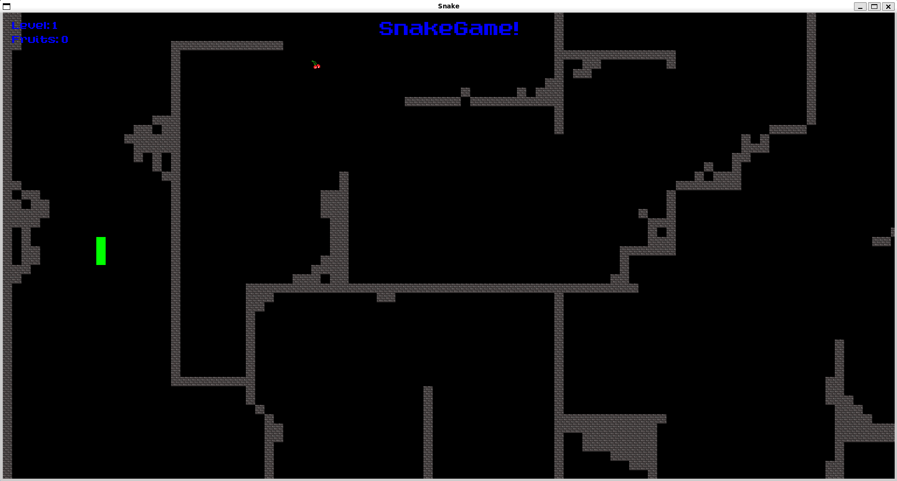

# Step05 - Schermo intero, menu responsive e miglioramenti UI



## 📌 Descrizione
In questo step il progetto evolve rispetto allo step04, introducendo:
- **Gestione schermo intero**: il gioco può essere eseguito sia in finestra che a schermo intero, con adattamento dinamico di tutti gli elementi UI.
- **Menu principale responsive**: il menu iniziale è sempre centrato e leggibile, indipendentemente dalla risoluzione o dalla dimensione dello schermo.
- **UI migliorata**: testi e popup (pausa, successo livello, game over) si adattano automaticamente alle dimensioni della finestra/camera, mantenendo proporzioni e spaziature ottimali.

## 🆕 Novità rispetto a Step04

| Funzionalità                | Step04                        | Step05 (questo step)                |
|-----------------------------|-------------------------------|-------------------------------------|
| Schermo intero              | Solo finestra                  | Finestra e schermo intero           |
| Menu responsive             | Statico, centrato base         | Completamente responsive            |
| UI popup                    | Responsive base                | Responsive avanzata                 |
| Adattamento font            | Statico                        | Dinamico in base alla view          |
| Overlay/popup               | Centrati, ma fissi             | Sempre centrati e scalati           |
| Esperienza utente           | Buona                          | Ottimale, moderna                   |

## 🔧 Dettagli implementativi

### 🖥 Gestione schermo intero e UI responsive
- Tutti i testi e box UI ora calcolano posizione e dimensione in base alla camera e alla risoluzione corrente.
- Il menu principale è sempre centrato e i font vengono scalati dinamicamente per garantire leggibilità.
- I popup di pausa e successo livello sono anch'essi responsive e centrati.

## 🗂️ Struttura aggiornata del progetto

```text
step05/
├── headers/                        # Header file delle principali classi di gioco
│   ├── engine.hpp                 # Definizione della classe Engine (logica principale del gioco)
│   ├── fruit.hpp                  # Definizione della classe Fruit (gestione frutti)
│   ├── snake.hpp                  # Definizione della classe Snake (gestione serpente)
│   ├── wall.hpp                   # Definizione della classe Wall (gestione muri/ostacoli)
├── src/                            # Implementazione delle classi principali
│   ├── engine.cpp                 # Implementazione della classe Engine
│   ├── fruit.cpp                  # Implementazione della classe Fruit
│   ├── main.cpp                   # Entry point del gioco (main)
│   ├── snake.cpp                  # Implementazione della classe Snake
│   └── wall.cpp                   # Implementazione della classe Wall
└── functionHandler/engineHandler/  # Moduli per la gestione delle varie funzionalità di gioco
    ├── cameraHandler.cpp          # Gestione della camera (view che segue lo snake)
    ├── directionArrowHandler.cpp  # Gestione della freccia direzionale che indica la frutta
    ├── draw.cpp                   # Funzioni di disegno/rendering degli elementi di gioco
    ├── fruitHandler.cpp           # Logica di generazione e gestione dei frutti
    ├── input.cpp                  # Gestione dell'input da tastiera
    ├── levelHandler.cpp           # Caricamento e gestione dei livelli di gioco
    ├── snakeHandler.cpp           # Logica di movimento e crescita dello snake
    ├── textHandler.cpp            # Gestione e posizionamento dei testi e UI
    ├── togglePauseHandler.cpp     # Gestione della pausa e dei popup relativi
    └── update.cpp                 # Aggiornamento dello stato di gioco a ogni frame
```

## ✅ Risultato
- Il gioco è ora perfettamente utilizzabile sia in finestra che a schermo intero, con UI sempre leggibile e centrata.
- Tutti i popup e menu sono responsive e si adattano a qualsiasi risoluzione.

## 🎮 Controlli
- **ENTER**: Avvia il gioco / conferma nei popup
- **ESC**: Esci dal gioco / torna al menu
- **Frecce direzionali**: Muovi lo snake
- **P**: Pausa/Resume

## 🏗️ Build ed esecuzione
### Build Standard
```bash
# Configurazione (genera anche compile_commands.json per VS Code)
cmake -S . -B build -DCMAKE_EXPORT_COMPILE_COMMANDS=ON

# Compilazione con copia automatica resources/
cmake --build build -j

# Esecuzione - ENTRAMBI i modi funzionano!
./step05                # Dalla directory build/
# OPPURE  
./build/step05          # Dalla directory principale
```